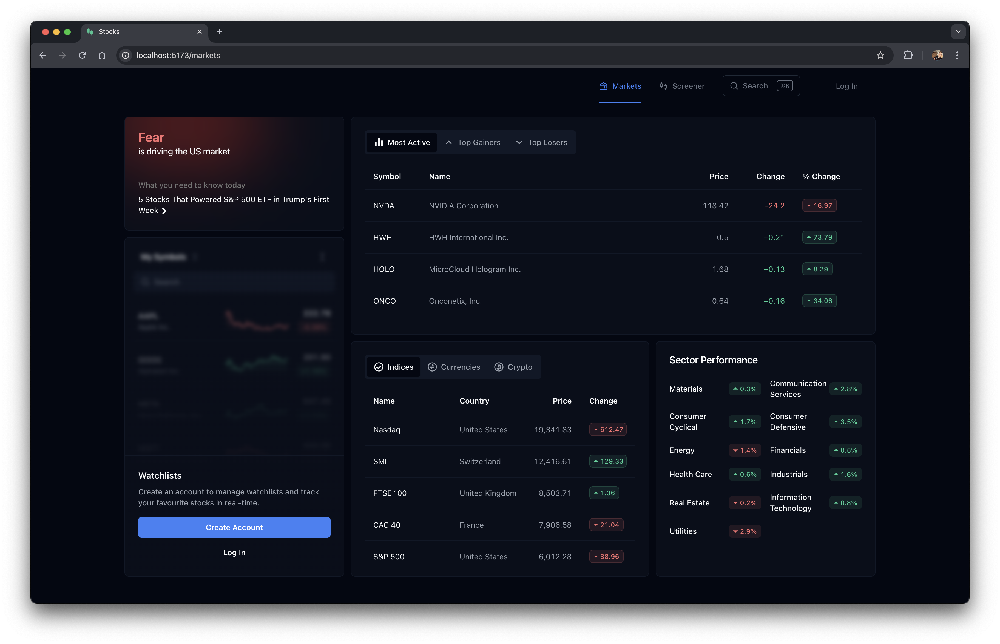
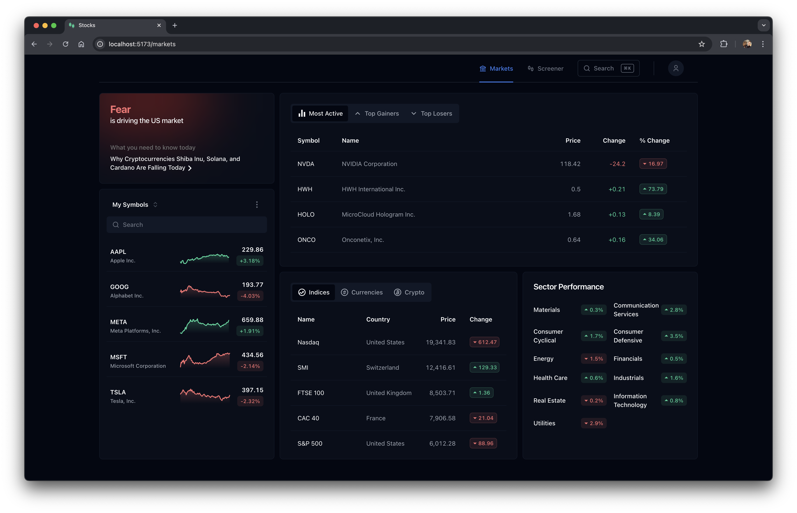
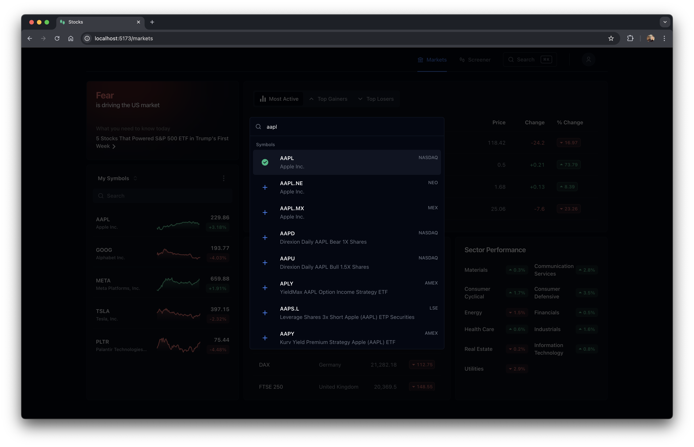
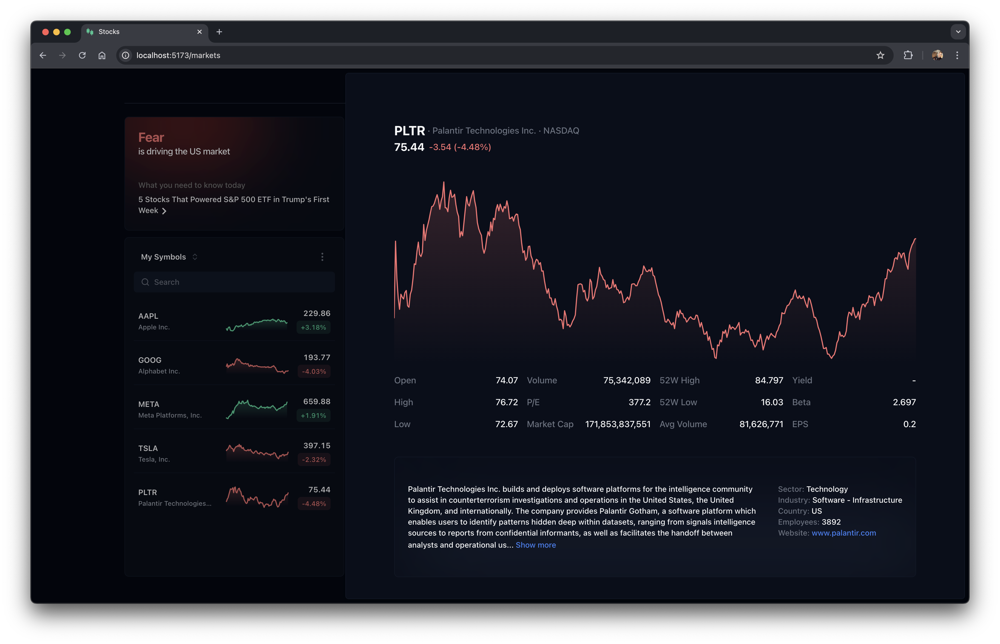
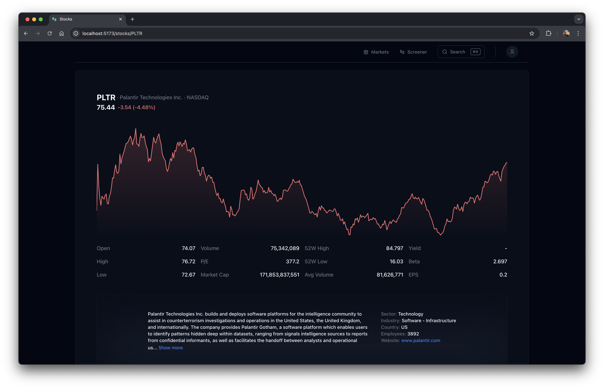
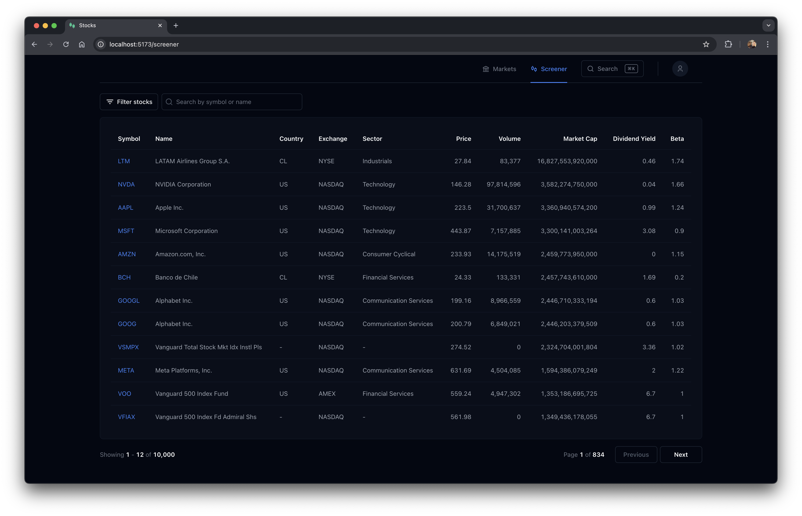

# Stocks (WIP)
**A stock tracking app with an advanced screener for analysing market data and stocks. Users can monitor trends, filter stocks by specific criteria and manage their watchlists.**

## Markets Overview
The _Markets_ view allows users to track overall market sentiment and follow the performance of different sectors. They can create and update personalised watchlists, adding or removing stocks of interest.

## Search
Users can search for symbols or company names to quickly find relevant stocks, adding or removing symbols from a watchlist.

## Stock Details
Selecting a stock opens a detailed view with in-depth information, including:

- Company details: name, industry, sector, website, description, etc.
- Stock metrics: real-time quote (price, change, open, high, low, close), volume, P/E ratio, market cap, yield, beta, EPS, etc.
- Price chart: displaying both intra-day and historical price movements.
- Company news and events: relevant updates impacting the stock.

## Screener
The _Screener_ enables users to search, sort and filter stocks based on criteria like trading volume, market capitalisation, P/E ratio, sector, etc., returning paginated results for efficient browsing.

## Tech Stack
Built with React, Vite and Tailwind CSS on the front end, and powered by Node.js, PostgreSQL, Socket.IO and Redis on the backend for real-time updates. Deployed on AWS.
